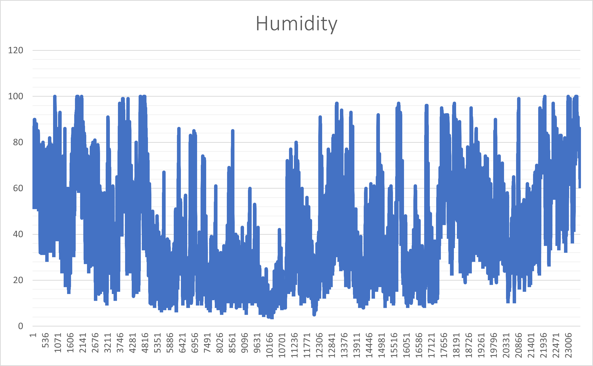
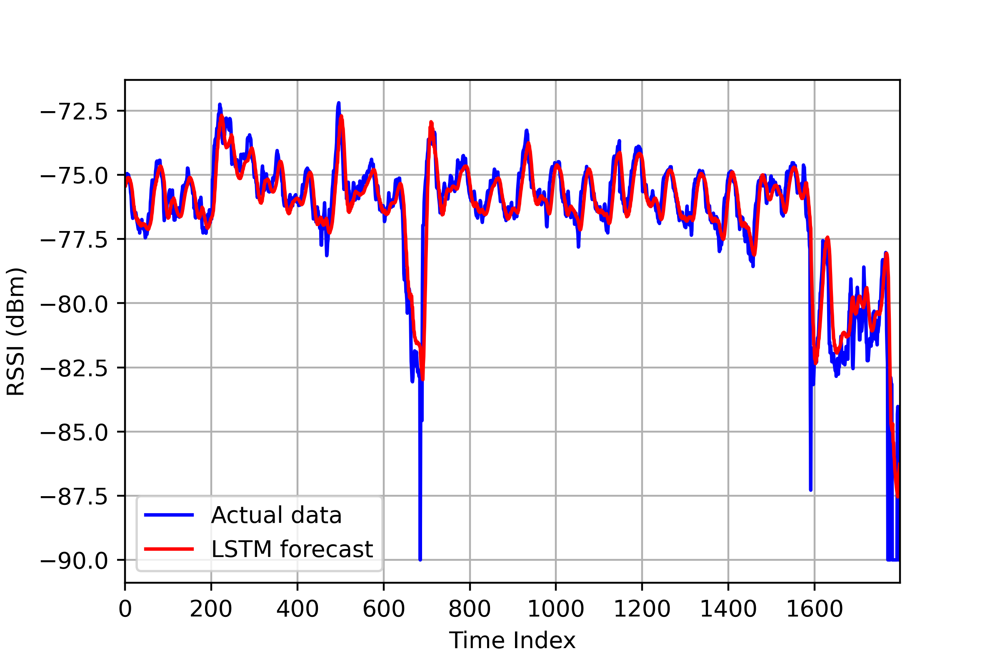
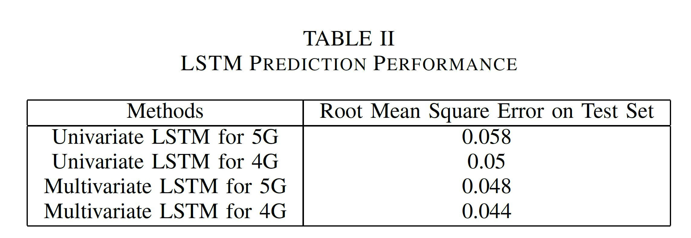

# RSS_LSTM_Forecast
> This repository contains the source code for the Accepted paper named *Investigation of 5G and 4G V2V Communication Channel Performance Under Severe Weather* in the IEEE International Conference on Wireless for Space and Extreme Environments (WiSEE 2022), Winnipeg, Manitoba.

5G vehicle-to-vehicle Received Signal Strength Forecaster using LSTM. In this work, we use LSTM to predict future RSSI values in case of severe weather for 5G mm-Wave and 4G LTE channels. We plan to use predicted RSSI values to determine signal degradation and design an auto channel switching strategy.

Long short-term memory (LSTM) is an artificial neural network used mainly for time-dependence series. LSTM is well suited for predicting time series data. This project proposes two LSTM model (univariate and multivariate) to predict future RSSI values of 5G and 4G channels.

## A. Dataset and Preprocessing
Recieved Signal Strength: Received Signal Strength Indicator (RSSI) measures how well a client can hear a signal. RSSI is a practical measure for determining if the transmitted signal strength is enough to get a good wireless connection. This project utilizes RSSI measurement to evaluate the performance of the 4G and 5G wireless communication channels. The RSSIs are generated in the NS3 Network Simulator for a year timespan and 20 minutes time interval between two measurements. The cleaned RSS dataset CSV file is upload on this directory. Figure below shows the RSS records. In order to study natural weather influences on mm-Wave and LTE transmissions; we want to use some actual weather in the USA, we collect weather(humidity/visibility) data from Climate Data Online (CDO) [1]. Our chosen dataset contains Local Climate logical Data (LCD) for BLANDING MUNICIPAL AIRPORT, UT, US, from 01/01/2021 to 12/31/2021. Weather is collected every 20 minutes, and after some accessible data cleaning, the total weather condition we used is 23528. Among those, humidity is considered as another feature for LSTM traning. The humidity profile is hsown below: 

  

  

## B. STM-based RSSI Prediction
We used RSSI and humidity as the model inputs to predict the future RSSI values. Figure below is the forecasting results based on multivariate LSTM. It receives a series of observations (from RSS and humidity) and learns from the past observations to predict future values in the sequence. We used RSS values from our NS-3 simulation to predict the future 5G mm-Wave and 4G LTE RSSIs, separately. To evaluate the model's performance, we selected the first 90\% of the RSSI dataset for training and the remaining 10\% for testing. 
The model includes an input layer, one LSTM layer with 100 LSTM units, and a Dropout layer with a value of 0.3. The Dropout, as its name implies, is responsible for randomly dropping neurons and units to avoid over-fitting in the neural network training process. The last layer is a fully-connected dense layer that aims to output the estimated values. The proposed model evaluation is carried out through training and validation losses calculations. Python 3.9.12 and TensorFlow 2.9.0 are employed to implement the deep LSTM model. The model is run for 40 epochs with batches size equal to 1024. Both univariate and multivariate scenarios are investiaged. In univariate case the input is RSS, while multivariate approach takes RSS and humidity as the inputs. The multivariate LSTM version showed a better performance than the univariate model. Because, in reality, the RSSI value changes as a function of these parameters. In other words, the future RSSI value not only depends on its current value but also on the current values of humidity, visibility and particle sizes.

  

The two prediction models performances are compared in table below:

  

### Reference:
1- “Climate data online (cdo) - the national climatic data center’s
(ncdc) climate data online (cdo) provides free access to ncdc’s
archive of historical weather and climate data in addition to station
history information. — national climatic data center (ncdc).” [Online].
Available: https://www.ncdc.noaa.gov/cdo-web
